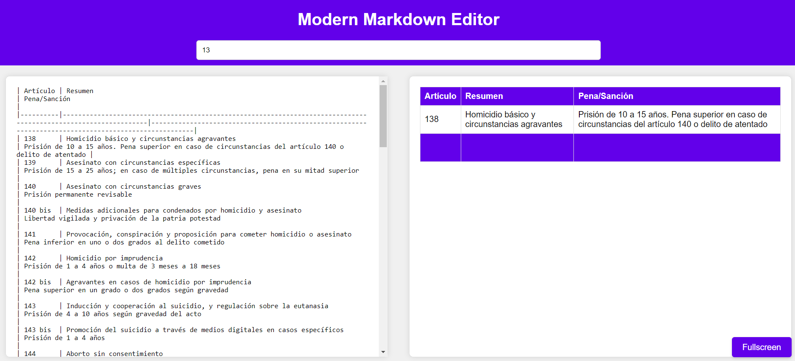

# Modern Markdown Editor

Modern Markdown Editor is a web-based editor that allows you to write, preview, and search within markdown files interactively. With its sleek design and intuitive user interface, writing and navigating through markdown has never been easier.

## Features

- **Live Markdown Rendering**: See your markdown rendering in real-time as you type.
- **Table Search**: Search within markdown tables to quickly find the information you need.
- **Fullscreen Mode**: Focus on your rendered markdown with a fullscreen mode, hiding the editor.
- **Persistent Storage**: Your markdown and search query are saved in the local storage to ensure no data is lost between sessions.

## Setup

1. Clone this repository or download the source code.
2. Open `index.html` file in your web browser.

## Usage

- Write your markdown content in the left pane.
- The rendered markdown will automatically be displayed on the right pane.
- Use the search bar at the top to search within markdown tables.
- Click on the **Fullscreen** button to toggle between fullscreen mode and split-screen mode.

## Dependencies

- [Font Awesome](https://fontawesome.com/v6.0/icons): For icons.
- [Markdown-it](https://markdown-it.github.io/): For rendering markdown.

## Screenshots

